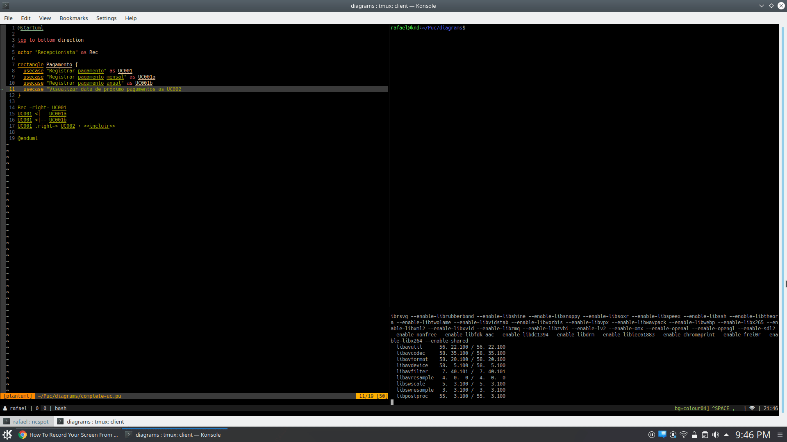

# plantuml-watch
A really really simple tool that watchs changes in a plantuml.



# Motivation
It is a pain in the neck perform repetitive tasks. This script will watch changes in file using inotify-tools.

# Prerequirements
- inotify-tools
- Bash
- Plantuml

# Install
```sh
$ git clone git@github.com:rafaelkendrik/plantuml-watch.git
$ cp plantuml-watch/plantuml-watch.sh /usr/bin/plantuml-watch
$ chmod +x /usr/bin/plantuml-watch
```

# Usage
> Make sure you are watching a git file!

```sh
$ plantuml-watch my-file.pu
```
